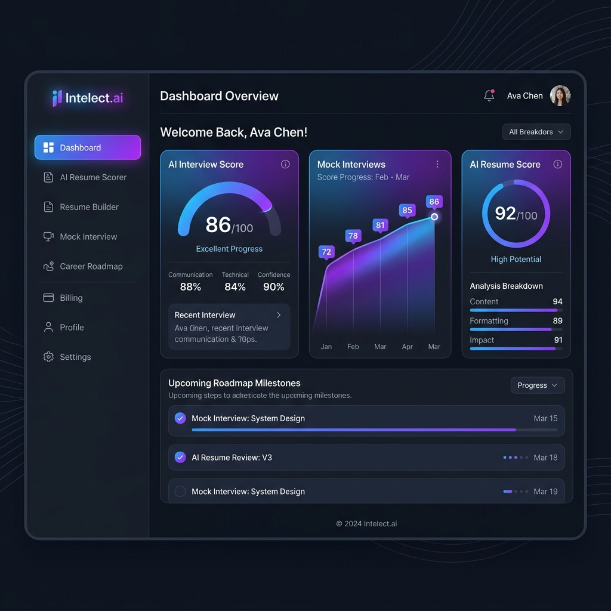

# 🚀 FresherAI - Autonomous AI Interview Platform



FresherAI is a state-of-the-art **Multi-Agent AI Platform** built to simulate highly realistic FAANG-level engineering interviews. Designed with a strict **Microservices Architecture**, this platform evaluates candidates on their problem-solving, system design, and coding skills dynamically.

It doesn't just read questions from a database—it dynamically parses actual GitHub repositories, adapts to different interviewer personas, executes live code, and analyzes speech in real time.

---

## 🏗️ Project Structure & Architecture

The project is split into a modular, highly decoupled architecture containing a frontend and a robust backend powered by multiple independent microservices and an API Gateway.

```text
AI Interview Platform/
├── frontend/               # React 18 + Vite frontend application
├── backend/
│   ├── gateway/            # Node.js API Gateway (Port 8000)
│   ├── shared/             # Shared utilities across microservices
│   └── services/           # Independent Microservices
│       ├── auth/           # Handles user authentication & sessions
│       ├── billing/        # Razorpay integration, credits & quotas
│       ├── interview/      # Core AI interview engine (LLM, Voice AI)
│       ├── resume/         # Resume parsing and evaluation
│       └── roadmap/        # Generates personalized AI learning roadmaps
├── docs/                   # Documentation and assets (images)
├── docker-compose.yml      # Orchestrates all services & databases
└── .env                    # Root environment configuration
```

### Microservices Data Strategy (Database-per-service)
To ensure complete decoupling, each microservice connects to its own dedicated MongoDB database:
* `AuthDb` 
* `ResumeDb`
* `InterviewDb`
* `RoadmapDb`
* `BillingDb`

---

## 🔥 Key "Wow" Features

- **🧠 Multi-Agent Architecture:** Uses a sophisticated state-machine graph where an Interview Agent, Feedback Agent, and Summary Agent pass state dynamically based on user input.
- **🎙️ Real-Time WebRTC & Voice AI:** Leverages browser native Web Speech API and `speechSynthesis` for an immersive audio-visual interview simulation without UI blocking.
- **💻 Integrated Live IDE Environment:** Candidates write and execute JavaScript locally in a sandboxed interceptor within the UI to test algorithms on the fly (Monaco Editor).
- **👨‍💻 "Grill Me on My GitHub" Engine:** Directly queries the GitHub REST API to pull a candidate's top repositories and injects them into the LLM context.
- **🎭 Interviewer Personas:** Select between extremely strict FAANG engineers, practical Startup CTOs, or friendly HR managers.
- **📊 Advanced Analytics (Heatmaps):** Built with `Recharts`, generating a 6-axis Radar chart of user skills (Correctness, Clarity, Detail, System Design, Communication).

---

## 💻 Tech Stack

### Frontend (Client Tier)
* **React 18 & Vite:** Lightning-fast HMR and optimized production builds.
* **Tailwind CSS & Framer Motion:** Ultra-modern Light SaaS UI with hardware-accelerated animations.
* **Redux Toolkit:** Efficient global state management.
* **Monaco Editor:** Real-time syntax highlighting for live coding.
* **Firebase:** Used for specific authentication/hosting capabilities.

### Backend (Service Tier)
* **Node.js & Express:** Scalable API gateway and independent microservice instances.
* **Groq API:** Ultra-fast LLM inference for real-time conversational AI.
* **MongoDB (Mongoose):** Flexible NoSQL document storage (Separate DBs per service).
* **Redis (ioredis):** Used for sub-millisecond caching of interview histories and rate-limiting.
* **Razorpay:** Integrated real-world webhook validation for purchasing API credits.

### Infrastructure & DevOps
* **Docker & Docker Compose:** Complete containerization of independent services, MongoDB, and Redis into a single `docker-compose up` command.

---

## 🚀 Getting Started

### Prerequisites
* Node.js v18+
* Docker Desktop
* Groq API Key
* MongoDB URI
* Razorpay API Keys (Optional, for billing)

### Environment Variables (.env)
Create a `.env` file in the root directory based on `.env.example`:

```env
FRONTEND_PUBLIC_URL=http://localhost
GATEWAY_PUBLIC_URL=http://localhost:8000
VITE_FIREBASE_APIKEY=your_firebase_api_key
GROQ_API_KEY=your_groq_api_key
YOUTUBE_API_KEY=your_youtube_api_key
RAZORPAY_KEY_ID=your_razorpay_key
RAZORPAY_KEY_SECRET=your_razorpay_secret

AUTH_MONGODB_URL=mongodb+srv://.../AuthDb
RESUME_MONGODB_URL=mongodb+srv://.../ResumeDb
INTERVIEW_MONGODB_URL=mongodb+srv://.../InterviewDb
ROADMAP_MONGODB_URL=mongodb+srv://.../RoadmapDb
BILLING_MONGODB_URL=mongodb+srv://.../BillingDb
```
*(Ensure each microservice in `/backend/services/` also receives its required `.env` files if running individually outside docker).*

### Running Locally (Via Docker)

```bash
# 1. Clone the repository
git clone https://github.com/yourusername/FresherAI.git
cd "AI Interview Platform"

# 2. Spin up the entire microservices cluster
docker-compose up --build -d
```
*Frontend will be running on `localhost:80` (or as configured) and API Gateway on `localhost:8000`.*
